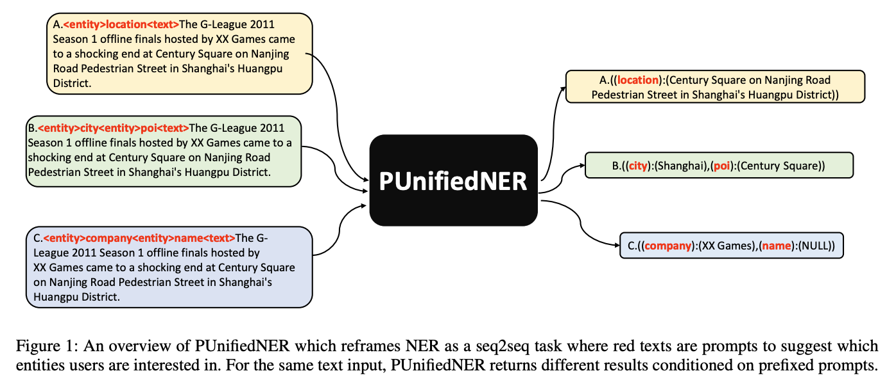

# PUnifiedNER:a Prompt-Based NER System Jointly Crossing Multiple NER Datasets (AAAI2023)

This repository is a replicate implementation based on paper [PUnifiedNER:a Prompt-Based NER System Jointly Crossing Multiple NER Datasets](https://arxiv.org/abs/2211.14838) (Accepted to the main conference of AAAI2023)

# Datasets

[People Daily (dev)](https://drive.google.com/file/d/174xsXuP1BsT8PsLUM0OkyMOZKtxICe0G/view?usp=sharing)

[People Daily (test)](https://drive.google.com/file/d/1qoPjyB9GGl6PSTdWkSzKQtYe_42qMZBW/view?usp=sharing)

[People Daily (train)](https://drive.google.com/file/d/1Vw0C92qgQrQcg5-pyNiB-1HAD_uPjECr/view?usp=sharing)

Other datasets can be found under ./ner_datasets/

## Usage

### Dependencies
Tested Python 3.6, and requiring the following packages, which are available via PIP:

* Required: [numpy >= 1.19.5](http://www.numpy.org/)
* Required: [scikit-learn >= 0.21.1](http://scikit-learn.org/stable/)
* Required: [pandas >= 1.1.5](https://pandas.pydata.org/)
* Required: [torch >= 1.9.0](https://pytorch.org/)
* Required: [transformers >= 4.8.2](https://huggingface.co/transformers/)
* Required: [datasets>=1.14.0](https://huggingface.co/docs/datasets/index)
* Required: [nltk>=3.6.5](https://www.nltk.org/)

### Quick Start

1. Prefix language model adapatation: sh_lm_adaption_1e-4_multi_gpus.sh

2. Multi-dataset PUnifiedNER tuning: sh_train_all_multi_gpus.sh

3. Test set evaluation: sh_eval_{dataset_name}.sh

4. Quick demo using Gradio: PUnifiedNER_Demo_Gradio.ipynb

### Demo video

[![Alternate Text]]({[video-url](https://drive.google.com/file/d/1510IVMpMp8AF01817iABxe2Pf3eUOE2p/view?usp=sharing)} "Link Title")

